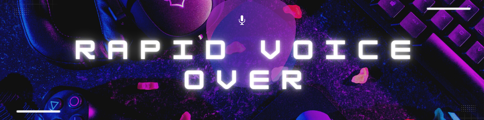

  

<h1 align="center">
  Rapid Voice Over 👋
</h1>

<h2 align="center">
Effortlessly capture 💻, record and combine 📸, seamless voice-over experience. 🎨!
</h2> 
 

Once you've recorded all of the necessary pieces, our app makes it easy to splice them together into a polished final product. Plus, we've included a range of customization options to help you fine-tune your recordings for a professional finish. Whether you need to adjust volume levels, add effects, or make other adjustments, our app has got you covered.

<h1> Instructions </h1>

- Paste Your Text 
- Click separate 
- Click Record
- Hit save

Creating professional-grade voice-overs has never been easier! Follow these simple steps to record your next masterpiece:

1. First, paste your script into our innovative recording app.
2. Click on "Separate" to begin recording your script piece by piece. This feature allows you to perfect each section without worrying about getting everything right in one take.
3. Click on "Record" to start capturing each section of your script. 
4. Keep recording until you've captured all the necessary pieces of your script.
5. Once you've recorded all the sections, our app will splice them together into a polished final product.
6. Finally, hit "Save". Easy!

With our intuitive and easy-to-use recording app, you can create high-quality voice-overs in no time. Download the app today and start recording your next masterpiec

